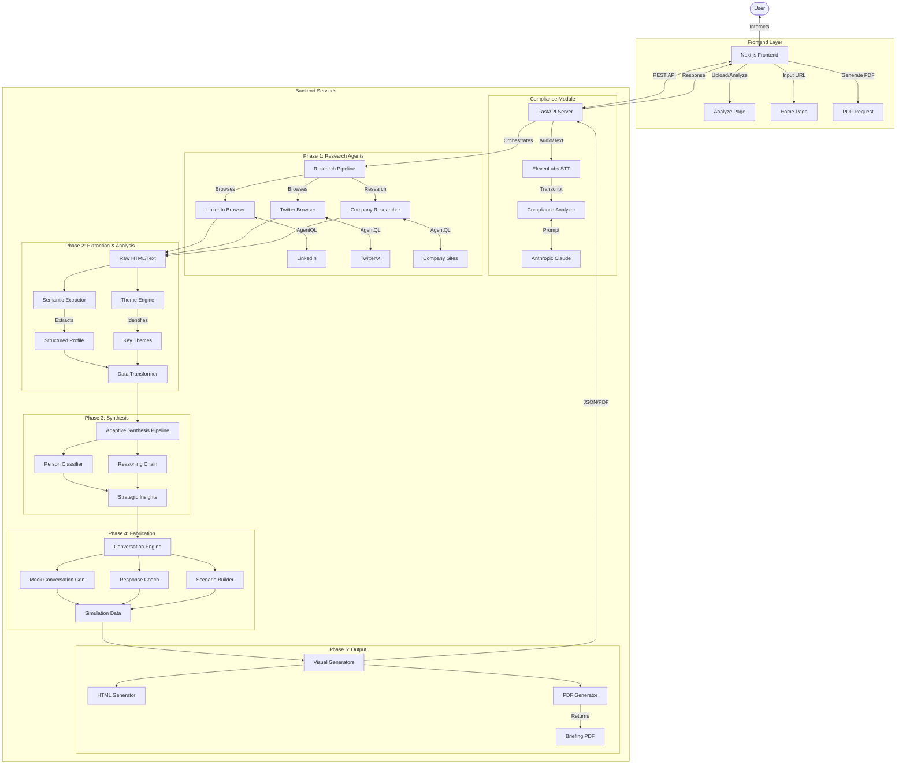

<div align="center">

#  BriefMe

### AI-Powered Research & Briefing Agent

<p align="center">
  
  
  
  
</p>

<p align="center">
  <strong>Automated research, synthesis, and briefing generation.</strong>
</p>

<p align="center">
  <a href="#-features">Features</a> •
  <a href="#-architecture">Architecture</a> •
  <a href="#-installation">Installation</a> •
  <a href="#-usage">Usage</a>
</p>

---

</div>

##  Features

<table>
<tr>
<td width="50%">

###  **Deep Research Agents**
Autonomous agents that browse LinkedIn, Twitter, and company websites to gather comprehensive intelligence.

</td>
<td width="50%">

###  **Adaptive Synthesis**
Intelligent pipeline that synthesizes raw data into structured insights, themes, and strategic talking points.

</td>
</tr>
<tr>
<td width="50%">

###  **Compliance Analysis**
Analyzes call transcripts for regulatory violations using Claude and ElevenLabs speech-to-text.

</td>
<td width="50%">

###  **Interactive Dashboard**
Modern Next.js frontend for visualizing profiles, themes, and generating PDF briefings on demand.

</td>
</tr>
<tr>
<td width="50%">

###  **Scenario Fabrication**
Generates mock conversations, pitch simulations, and likely questions to prepare you for meetings.

</td>
<td width="50%">

###  **PDF Generation**
Automatically creates professional PDF briefings ready for download and offline use.

</td>
</tr>
</table>

---

##  Architecture

<div align="center">



</div>

### Directory Structure

```
BriefMe/
├── 🐍 backend/                 # Python FastAPI Backend
│   ├── 🤖 src/agents/          # Research agents (LinkedIn, Twitter)
│   ├── 🧠 src/synthesis/       # Synthesis and reasoning pipelines
│   ├── 📝 src/extractors/      # Data extraction and transformation
│   ├── 💬 src/fabricate/       # Conversation simulation
│   └── 🎨 src/visual/          # PDF and HTML generation
├── ⚛️ frontend/                # Next.js Frontend
│   ├── 🧩 components/          # React components
│   └── 📄 app/                 # Next.js pages and routes
└── 📄 README.md                # This file
```

---

##  Installation

### Prerequisites

<table>
<tr>
<td>

** Python**
```
Python 3.8+
```

</td>
<td>

** Node.js**
```
Node.js 18+
```

</td>
<td>

** API Keys**
```
Yutori, ElevenLabs, Anthropic
```

</td>
</tr>
</table>

### Step 1: Backend Setup

```bash
# Navigate to backend
cd backend

# Install dependencies
pip install -r requirements.txt

# Create .env file with your API keys
cp .env.example .env
```

### Step 2: Frontend Setup

```bash
# Navigate to frontend
cd frontend

# Install dependencies
npm install
```

---

##  Usage

###  Running the API Server

Start the FastAPI backend to handle requests:

```bash
# From the backend directory
python api_server.py
```
The server will start at `http://localhost:8000`.

###  Running the Frontend

Start the Next.js development server:

```bash
# From the frontend directory
npm run dev
```
Open `http://localhost:3000` to access the BriefMe dashboard.

###  CLI Usage

You can also run the research pipeline directly from the CLI:

```bash
# From the backend directory
python main.py
```

---

<div align="center">

###  Built for Intelligence

<p>
  
  
</p>

**[⬆ Back to Top](#-briefme)**

</div>
