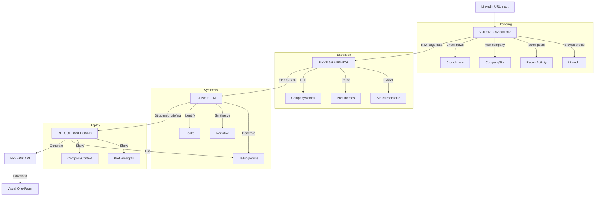

# Brief Me: Automated Meeting Briefing Agent

## The Problem (That Every Judge Has Felt)
You have a meeting in 10 minutes. You know nothing about the person. You frantically open LinkedIn, scroll through their posts, check their company, Google their name — and still walk in underprepared.
This is universal. Every judge, every developer, every human has felt this panic.

## The Solution
Paste a LinkedIn URL → Get a complete briefing in 60 seconds:

*   **Who they are** (role, background, career trajectory)
*   **What they care about** (recent posts, interests, causes)
*   **Their company context** (funding, news, competitors)
*   **Conversation starters** (3 personalized talking points)
*   **Visual one-pager** (shareable PDF briefing)

No clicking around. No tab chaos. One input, complete output.

## Why This Wins
| Feature | Why "Brief Me" Scores Highest |
| :--- | :--- |
| **Autonomy** | Agent decides which sources matter, what to prioritize, how to synthesize. Zero human intervention. |
| **Idea** | Universal pain point. Every judge has scrambled before a meeting. Instant emotional connection. |
| **Technical Implementation** | Clean pipeline: Yutori browses → TinyFish extracts → Cline synthesizes → Retool displays → Freepik generates PDF. Sophisticated but achievable. |
| **Tool Use** | 5 sponsor tools, each with a genuine purpose. Nothing forced. |
| **Presentation** | "Give me anyone's LinkedIn" → magic happens → judges see themselves using this tomorrow. |

## Technical Architecture

## Build Schedule (5.5 Hours)
*   **Hour 1:** Yutori integration — browse LinkedIn profile + company
*   **Hour 2:** TinyFish extraction — structured data from pages
*   **Hour 3:** Retool dashboard — display all components
*   **Hour 4:** Cline synthesis — talking points generation
*   **Hour 4.5:** Freepik integration — visual one-pager
*   **Hour 5-5.5:** Polish, backup recordings, demo practice

## The Demo Script (3 Minutes)
*   **0:00 – 0:20:** "Raise your hand if you've ever scrambled to research someone before a meeting. [Hands go up] Brief Me fixes that. Give me anyone's LinkedIn URL."
*   **0:20 – 0:30:** Judge provides a URL (or you have backup: a VC, a CEO, a speaker at the event).
*   **0:30 – 1:30:** Agent runs LIVE on screen:
    *   Yutori opens LinkedIn, scrolls through their profile, recent posts
    *   Jumps to their company website, Crunchbase, recent news
    *   TinyFish extracts structured data
    *   Progress bar shows synthesis happening
*   **1:30 – 2:15:** Dashboard populates:
    *   Profile summary
    *   Career trajectory visualization
    *   "What they care about" section (pulled from posts)
    *   3 personalized talking points
    *   Company context panel
*   **2:15 – 2:45:** Freepik-generated visual one-pager appears. "This is shareable. Send it to yourself before any meeting."
*   **2:45 – 3:00:** "Brief Me uses Yutori for browsing, TinyFish for extraction, Cline for synthesis, Retool for the dashboard, and Freepik for the visual output. Five tools. Sixty seconds. Never walk into a meeting unprepared again."

## Backup Plan
If LinkedIn blocks Yutori during the hackathon (unlikely but possible):
*   **Pivot:** Company research. Same flow, but input is a company name instead of a person.
*   **Research:** Their website, Crunchbase, news, competitors.
*   **Output:** Company briefing instead of a person briefing.
*   **Impact:** Same architecture. Same tools. Same demo impact.
