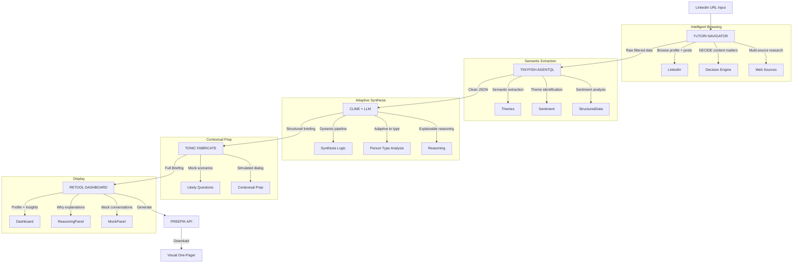

# Brief Me: Automated Meeting Briefing Agent

## The Problem (That Every Judge Has Felt)
You have a meeting in 10 minutes. You know nothing about the person. You frantically open LinkedIn, scroll through their posts, check their company, Google their name — and still walk in underprepared.
This is universal. Every judge, every developer, every human has felt this panic.

## The Solution
Paste a LinkedIn URL → Get a complete briefing in 60 seconds:

*   **Who they are** (role, background, career trajectory)
*   **What they care about** (recent posts, interests, causes)
*   **Their company context** (funding, news, competitors)
*   **Conversation starters** (3 personalized talking points)
*   **Mock Conversation Scenarios** (Simulated Q&A based on their profile)
*   **Visual one-pager** (shareable PDF briefing)

No clicking around. No tab chaos. One input, complete output.

## Judge-Optimized Strategy
*Same core concept, but repositioned for the room.*

### For Dhruv Batra (Yutori — $3,500)
**Goal:** Show Navigator making intelligent decisions, not just scraping.
*   **Action:** Agent visits profile → decides which posts reveal personality (not just recent, but meaningful).
*   **Action:** Agent finds company → autonomously determines if funding news or product launches matter more for this specific person.
*   **Key Demo Moment:** "The agent found 47 data points but surfaced these 5 because they're most relevant for a first meeting."
*   **Pitch:** "Navigator isn't just browsing — it's prioritizing. It decided this person cares about AI ethics based on their post history, so it surfaced that as a talking point instead of their job title."

### For Karl Hanson (Tonic.AI — Co-Founder)
**Goal:** Show him something he hasn't seen (Fabricate for context, not just test data).
*   **Action:** After the briefing is generated, Fabricate creates mock conversation scenarios based on the person's profile.
*   **Output:** "Based on their interests, here are 3 likely questions they'll ask you" or "Here's a simulated back-and-forth if you pitch them X".
*   **Pitch:** "Fabricate isn't just generating test data — it's generating preparation. Contextual mock conversations based on real profile intelligence."

### For Homer W. (TinyFish — Head of Product)
**Goal:** Show semantic extraction and product sense, not just "extract text".
*   **Action:** Don't just pull LinkedIn posts → Extract themes and sentiment.
*   **Action:** "This person posts about developer experience 3x more than anything else".
*   **Pitch:** "AgentQL isn't parsing HTML — it's understanding intent. It identified that this person's professional identity is centered on developer advocacy, not their job title."

### For Simon Tiu (Vertex Ventures — VC)
**Goal:** Pitch the business case ($3B TAM).
*   **Pitch:** "This is a wedge into a $3B market. ZoomInfo, Apollo, Lusha — they sell contact data. We sell context. Sales teams don't need another database. They need to walk into meetings prepared. This is 10x better than what exists and it's autonomous."

### For Gagan Bhat (Anthropic)
**Goal:** Show reasoning and AI quality.
*   **Action:** Add a "Why" panel to the dashboard.
*   **Output:** "Here's why I chose these talking points" or "This insight is ranked #1 because it connects to your stated meeting goal".
*   **Pitch:** Transparency into the agent's decision-making.

### For Juan Pablo (Cline)
**Goal:** Show MCP doing something interesting (dynamic logic).
*   **Action:** Use Cline to generate the synthesis logic dynamically. Don't hardcode how talking points are generated — have Cline create the synthesis function based on the profile type (engineer vs. executive vs. creative).
*   **Pitch:** "Cline isn't just writing code — it's adapting the analysis pipeline to the person type. Different synthesis for a CTO vs. a designer."

## The Final Architecture (Judge-Optimized)

## The Demo Script (Rewritten for These Judges)
*   **0:00 – 0:15:** "Every person in this room has walked into a meeting underprepared. Brief Me fixes that in 60 seconds. Dhruv, can I use your LinkedIn?" (Using a judge's profile is bold but memorable. Have a backup ready.)
*   **0:15 – 1:00:** Agent runs live. Narrate the decisions:
    *   "Navigator is browsing... it found 12 posts but it's prioritizing the ones about [topic] because those reveal what Dhruv actually cares about"
    *   "Now it's checking Yutori's Crunchbase... deciding if funding news matters for this context"
*   **1:00 – 1:45:** Dashboard populates. Highlight the novel parts:
    *   "These talking points aren't random — the agent decided these based on theme analysis"
    *   "Fabricate generated mock questions Dhruv might ask based on his research background"
    *   "Here's the reasoning chain — why each insight was selected"
*   **1:45 – 2:30:** Visual one-pager appears. "This is shareable. Send it to yourself 5 minutes before any meeting."
*   **2:30 – 3:00:** "Brief Me uses Yutori for intelligent browsing, TinyFish for semantic extraction, Cline for adaptive synthesis, Fabricate for contextual mock conversations, Retool for the dashboard, and Freepik for the visual output. Six sponsor tools. One input. Sixty seconds. Never walk into a meeting unprepared."

## Why This Wins With These Judges
| Judge | Why They Vote For You |
| :--- | :--- |
| **Dhruv Batra** | You showed Navigator deciding what matters, not just scraping. That's the whole point of Yutori. |
| **Karl Hanson** | Mock conversation generation from profile data is novel. He hasn't seen Fabricate used for contextual prep. |
| **Homer W.** | Semantic theme extraction, not just text parsing. Product-minded usage. |
| **Simon Tiu** | Clear business case. $3B TAM. Better than existing tools. Fundable. |
| **Gagan Bhat** | Explainable AI. Reasoning transparency. Thoughtful integration. |
| **Juan Pablo** | Cline doing dynamic pipeline generation, not just boilerplate code. |
| **AWS judges** | Clean architecture. Could scale. Event-driven potential. |

## The One-Liner
*When Dhruv Batra asks "What did you build?"*

"An agent that doesn't just research people — it decides what matters about them. Paste a LinkedIn URL, get a complete briefing with talking points and mock conversations in 60 seconds. Navigator handles the browsing, but the intelligence is in what it chooses to surface."

## Build Schedule (5.5 Hours)
*   **Hour 1:** Yutori integration — browse LinkedIn profile + company
*   **Hour 2:** TinyFish extraction — structured data from pages
*   **Hour 3:** Retool dashboard — display all components
*   **Hour 4:** Cline synthesis & Tonic Fabricate — talking points & mock conversations
*   **Hour 4.5:** Freepik integration — visual one-pager
*   **Hour 5-5.5:** Polish, backup recordings, demo practice

## Backup Plan
If LinkedIn blocks Yutori during the hackathon (unlikely but possible):
*   **Pivot:** Company research. Same flow, but input is a company name instead of a person.
*   **Research:** Their website, Crunchbase, news, competitors.
*   **Output:** Company briefing instead of a person briefing.
*   **Impact:** Same architecture. Same tools. Same demo impact.
